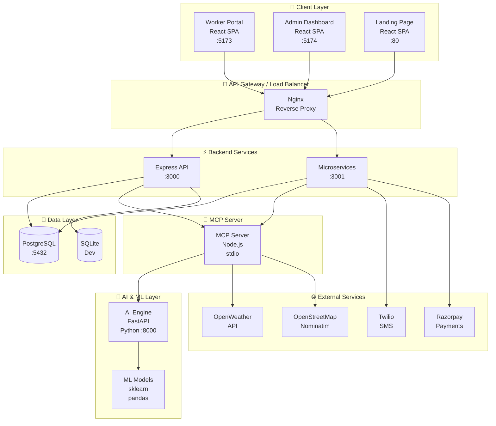
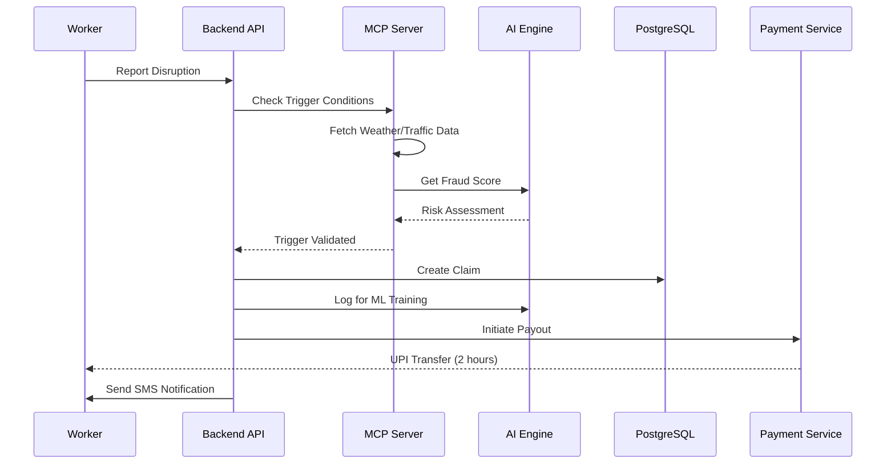
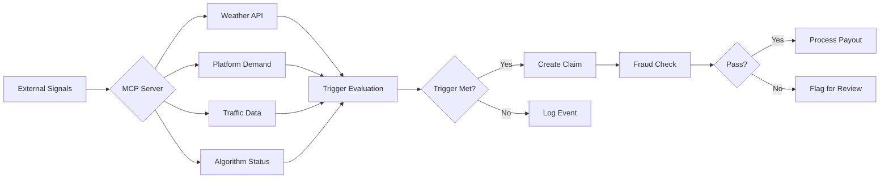

# EarnSure Architecture Documentation

  

## Overview

EarnSure is a **microservices-based parametric insurance platform** designed specifically for gig economy workers in India. The system provides automatic income protection when external disruptions (weather, algorithm changes, platform demand drops) affect a worker's ability to earn.

---

## System Architecture Diagram



---

## Component Architecture

### 1. Client Layer

| Component | Technology | Port | Purpose |
|-----------|------------|------|---------|
| Worker Portal | React + Vite | 5173 | Rider dashboard, claims, policies |
| Admin Dashboard | React + Vite | 5174 | Portfolio management, fraud monitoring |
| Landing Page | React + Vite | 80 | Marketing, sign-up flow |

**Key Features:**
- Role-based access control (Worker/Admin)
- Real-time notifications
- Responsive design for mobile
- Dark/Light theme support

---

### 2. Backend Services

#### Express API (`backend/`)
```
┌─────────────────────────────────────────────────────────┐
│                    Express API Server                    │
├─────────────────────────────────────────────────────────┤
│  Routes:                                                 │
│  ├── /auth      - Authentication, OTP verification      │
│  ├── /workers   - Worker profile management             │
│  ├── /policies  - Policy CRUD operations                │
│  ├── /claims    - Claim filing and tracking            │
│  ├── /admin     - Admin operations, analytics          │
│  └── /mcp       - MCP tool integration                  │
├─────────────────────────────────────────────────────────┤
│  Middleware:                                             │
│  ├── JWT Authentication                                 │
│  ├── Role-based Access Control                          │
│  ├── Request Logging                                    │
│  └── Error Handling                                     │
└─────────────────────────────────────────────────────────┘
```

#### Microservices (`backend-services/`)
```
┌─────────────────────────────────────────────────────────┐
│                  Microservices Layer                     │
├─────────────────────────────────────────────────────────┤
│  Services:                                               │
│  ├── PolicyLifecycleService    - Policy state machine  │
│  ├── AutoClaimService          - Automatic claim gen   │
│  ├── NotificationService       - SMS/WhatsApp alerts   │
│  ├── PayoutService              - UPI disbursements     │
│  ├── DowntimeService            - Algorithm monitoring  │
│  ├── TrafficService            - Traffic data          │
│  ├── AQIService                 - Air quality monitoring │
│  ├── PlatformDemandService     - Platform order data    │
│  └── AuditService              - Compliance logging    │
├─────────────────────────────────────────────────────────┤
│  Scheduled Jobs:                                         │
│  ├── PolicyScheduler           - Premium collection    │
│  └── RiskScheduler             - Risk evaluation       │
└─────────────────────────────────────────────────────────┘
```

---

### 3. AI & ML Layer (`ai-engine/`)

```
┌─────────────────────────────────────────────────────────┐
│                    AI Engine (FastAPI)                   │
├─────────────────────────────────────────────────────────┤
│  Endpoints:                                             │
│  ├── /health                    - Health check         │
│  ├── /risk/predict              - Risk scoring          │
│  ├── /fraud/score               - Fraud detection       │
│  ├── /train                     - Model training       │
│  └── /model/info                - Model metadata       │
├─────────────────────────────────────────────────────────┤
│  Models:                                                │
│  ├── RiskPredictionModel        - Premium calculation  │
│  ├── FraudDetectionModel        - Anomaly detection    │
│  └── DowntimePredictor          - Algorithm failure     │
├─────────────────────────────────────────────────────────┤
│  Tech Stack:                                            │
│  ├── FastAPI                    - API framework        │
│  ├── scikit-learn               - ML algorithms        │
│  ├── pandas                     - Data processing       │
│  └── joblib                     - Model serialization  │
└─────────────────────────────────────────────────────────┘
```

---

### 4. MCP Server (`mcp-server/`)

The Model Context Protocol server provides tools for AI agents:

```
┌─────────────────────────────────────────────────────────┐
│                    MCP Server Tools                       │
├─────────────────────────────────────────────────────────┤
│  Tool                    │ Purpose                      │
│  ───────────────────────┼────────────────────────────  │
│  weather_tool           │ Fetch weather data           │
│  risk_prediction_tool   │ AI risk scoring              │
│  claim_tool             │ Create/manage claims         │
│  fraud_detection_tool   │ Analyze fraud patterns       │
│  risk_pool_tool         │ Pool management              │
│  payment_tool           │ Process payouts              │
│  zone_recommendation    │ Best zones for today         │
│  location_tool          │ Geocoding & reverse geocode │
│  algorithm_downtime     │ Detect platform throttling  │
│  income_stability       │ Track income patterns       │
└─────────────────────────────────────────────────────────┘
```

---

### 5. Data Layer

#### Database Schema (PostgreSQL)

```
┌─────────────────────────────────────────────────────────┐
│                  Database Schema                        │
├─────────────────────────────────────────────────────────┤
│  Core Tables:                                           │
│  ├── workers           - Rider profiles                │
│  ├── policies          - Insurance policies           │
│  ├── claims            - Insurance claims              │
│  ├── risk_events       - Trigger events                │
│  ├── pools             - City-level risk pools         │
│  └── pool_members      - Pool membership               │
├─────────────────────────────────────────────────────────┤
│  Activity Tables:                                       │
│  ├── worker_activity   - Daily activity logs          │
│  ├── zone_demand       - Zone demand levels            │
│  ├── traffic_events    - Traffic congestion data       │
│  ├── platform_demand   - Platform order volume          │
│  └── algorithm_events  - Algorithm downtime events     │
├─────────────────────────────────────────────────────────┤
│  Financial Tables:                                      │
│  ├── transactions      - All financial movements       │
│  ├── policy_payments   - Premium collections            │
│  ├── pool_transactions - Pool deposits/withdrawals     │
│  └── reinsurance_fund  - Catastrophic reserve          │
├─────────────────────────────────────────────────────────┤
│  Support Tables:                                        │
│  ├── notifications     - Worker notifications          │
│  ├── audit_logs        - System audit trail             │
│  └── fraud_features    - ML feature store              │
└─────────────────────────────────────────────────────────┘
```

---

## Data Flow Architecture

### Claim Processing Flow



### Risk Assessment Flow



---

## Security Architecture

```
┌─────────────────────────────────────────────────────────┐
│                   Security Layers                        │
├─────────────────────────────────────────────────────────┤
│  1. Authentication                                       │
│     ├── JWT Tokens (Access + Refresh)                   │
│     ├── OTP Verification (Twilio)                        │
│     └── Session Management                               │
├─────────────────────────────────────────────────────────┤
│  2. Authorization                                        │
│     ├── Role-based Access Control (RBAC)                │
│     ├── Worker vs Admin permissions                      │
│     └── API endpoint protection                         │
├─────────────────────────────────────────────────────────┤
│  3. Data Security                                        │
│     ├── Parameterized SQL queries                       │
│     ├── Input validation (Zod schemas)                  │
│     ├── XSS/CSRF protection                             │
│     └── HTTPS/TLS encryption                           │
├─────────────────────────────────────────────────────────┤
│  4. Fraud Prevention                                    │
│     ├── GPS trajectory analysis                         │
│     ├── Device fingerprinting                           │
│     ├── Behavioral biometrics                           │
│     └── Multi-signal verification                       │
└─────────────────────────────────────────────────────────┘
```

---

## Deployment Architecture

### Production (Docker Compose)

```yaml
# docker-compose.yml overview
services:
  db:              # PostgreSQL 16
  ai-engine:       # Python FastAPI
  backend-services:# Node.js microservices
  frontend:        # React static files
  prometheus:      # Metrics collection
  grafana:         # Dashboards
```

### Environment Matrix

| Service | Dev | Staging | Production |
|---------|-----|---------|------------|
| Database | SQLite | PostgreSQL | PostgreSQL (RDS) |
| Auth | JWT | JWT | JWT + 2FA |
| Cache | None | Redis | Redis |
| Logs | Console | File | CloudWatch |
| Monitoring | None | Basic | Full (Prometheus + Grafana) |

---

## Scalability Considerations

### Horizontal Scaling
- Backend services are stateless
- Load balance across multiple instances
- Database read replicas for queries

### Vertical Scaling
- Connection pooling (PostgreSQL)
- Worker threads for CPU tasks
- Caching layer (Redis) for frequently accessed data

### Performance Targets
- API response time: < 200ms (p95)
- Claim processing: < 2 hours
- System uptime: 99.9%
- Concurrent workers: 10,000+

---

## Technology Stack Summary

```
Frontend:
├── React 18
├── Vite
├── React Router
└── CSS Modules

Backend:
├── Node.js 18+
├── Express.js
├── PostgreSQL
├── JWT
└── Socket.io

AI/ML:
├── Python 3.10+
├── FastAPI
├── scikit-learn
└── pandas

Infrastructure:
├── Docker
├── Docker Compose
├── Nginx
└── Prometheus + Grafana

External APIs:
├── OpenWeather
├── OpenStreetMap
├── Twilio
└── Razorpay
```

---

## Project Structure

```
earnsure/
├── backend/              # Express.js API server
├── backend-services/      # Microservices
├── ai-engine/            # Python ML service
├── mcp-server/           # MCP tools
├── frontend/             # Worker portal
├── frontend-admin/       # Admin dashboard
├── frontend-worker/      # Worker app
├── database/            # Schema & migrations
├── docs/                # Documentation
├── monitoring/          # Prometheus & Grafana
└── docker-compose.yml   # Container orchestration
```

---

## Getting Started

### Quick Start (Docker Compose)
```bash
cd earnsure
docker-compose up --build
```

### Manual Setup
```bash
# 1. Database
docker-compose up db

# 2. AI Engine
cd ai-engine && pip install -r requirements.txt
uvicorn app.main:app --port 8000

# 3. Backend
cd backend && npm install && npm start

# 4. Frontend
cd frontend && npm install && npm run dev
```

---

## License

MIT License - See [LICENSE](LICENSE) for details.

---

## Contributing

1. Fork the repository
2. Create a feature branch
3. Make your changes
4. Submit a pull request

---

*Last Updated: 2026-03-20*
*Version: 1.0.0*
*Architecture: Microservices with AI/ML Layer*
